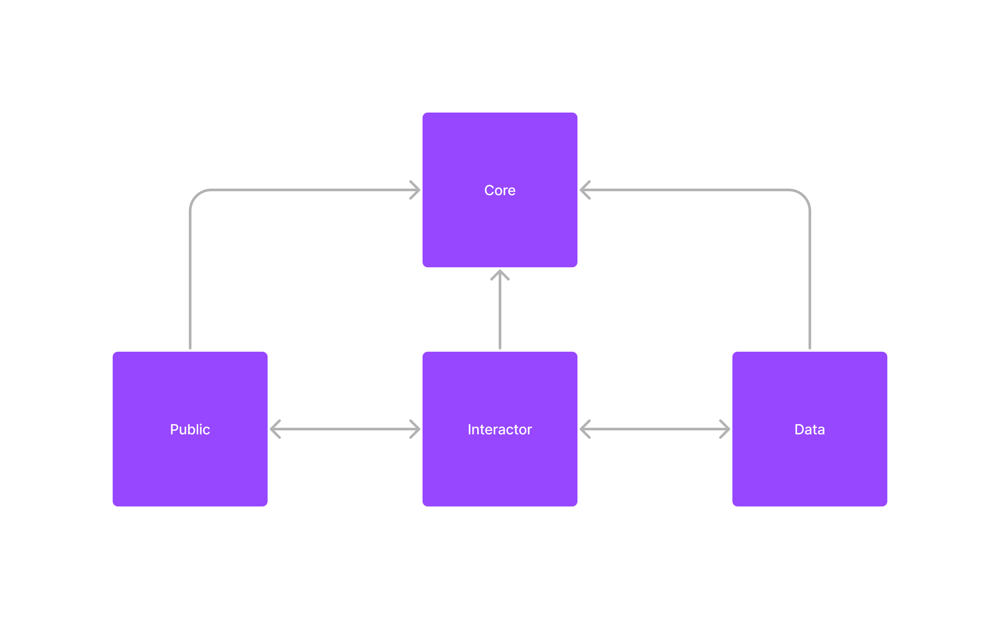

# YuNO Architecture

This architecture aims to clearly separate responsibilities into layers, making code maintenance, testability, and scalability easier. Each layer has a specific purpose, and dependencies are organized so that business logic is not tightly coupled to technical implementation, allowing flexibility and ease of system evolution.



## 1. Layers

### 1.1 Public

Encompasses all pages and subpages of the application.

- **Pages:**
  - Represents the user interface layer.
  - Should be decoupled as much as possible from non-essential UI packages.
- **Widgets:**
  - Contains specific visual components for a single page.

### 1.2 Interactor

Encompasses business rules and yours interfacer.

- **Atoms:**
  - Small building blocks representing atomic units of functionality.
- **Actions:**
  - Represents actions that can be performed in the system.
- **Interfaces of Repositories and Services:**
  - Defines contracts for interactions with data layers.

### 1.3 Data

Encompasses the execution of business rules.

- **Implementations:**
  - **Repositories and Services:**
    - Contains concrete implementations of contracts defined in the Interactor layer.
    - Responsible for interacting with external data sources such as databases or APIs.

### 1.4 Core

Encompasses global data for the application.

- **Themes:**
  - Defines visual styles and themes for the application.
- **Assets:**
  - Stores static resources such as images, icons, etc.
  - Every type of asset requires a specific file, with its names listed and pre-cached in a function.
- **Widgets:**
  - Reusable components that can be used in different parts of the application.
- **Other Global Data:**
  - Includes other elements essential for the global operation of the application.

## 2. Nomenclatures

This section outlines the naming conventions for different components of our application including widgets, actions, atoms, repositories, and services.

### 2.1 Widgets

### Guidelines for Widget Naming

- **Suffix "Widget":** All widget classes should consistently use the "Widget" suffix. This makes it easier to identify them in the codebase.
- **Clarity and Consistency:** The name should clearly reflect the widget's functionality.
- **Example:** `login_button_widget.dart`

```dart
class LoginButtonWidget extends StatelessWidget { }
```

### 2.2 Actions

### Guidelines for Action Naming

- **Verb-Noun Format:** Names of actions should typically follow a verb-noun format, indicating what the action does.
- **Descriptive:** Ensure the name gives a clear indication of its purpose.
- **Example:** `config_action.dart`

```dart
Future<T> fetchConfig() {}
Future<T> saveConfig() {}
```

### 2.3 Atoms

### Guidelines for Atom Naming

- **Descriptive and Concise:** Atom names should be concise yet descriptive enough to indicate their role and usage.
- **Component Specific:** Name atoms based on their functionality or the data they handle.
- **Example:**
`config_atom.dart`

```dart
final configState = Atom<T>();
```

### 2.4 Repositories

### Guidelines for Repository Naming

- **Noun Format:** Repository names should be clear, concise nouns.
- **Reflect Data Model:** They should closely reflect the data model or resource they are associated with.
- **Example:**
`game_repository.dart`

```dart
  class GameRepository { }
```

### 2.5 Services

### Guidelines for Service Naming

- **Noun or Verb-Noun Format:** Service names can be nouns or verb-noun combinations, indicating the service provided.
- **Purpose-Clear:** The name should clearly reflect the functionality or the domain of the service.
- **Example:**
`authentication_service.dart`

```dart
  class AuthenticationService { }
```

This structured approach provides a clear and organized set of naming conventions across different elements of the application, ensuring consistency and clarity in the codebase.

## 3. Tests

Testing is a crucial part of software development. It ensures code quality and functionality, and helps in maintaining the software over time. Our testing approach adheres to the triple-A pattern (Arrange, Act, Assert) for its clarity and structure.

For an in-depth understanding, refer to this article on the [Triple-A Pattern](https://medium.com/@pjbgf/title-testing-code-ocd-and-the-aaa-pattern-df453975ab80).

### Example

```dart
test('should execute a sum correctly', () {

  // arrange
  int number1 = 2;
  int number2 = 1;

  // act
  final result = sumFunction(number1, number2);

  // assert
  expect(result, 3);

});
```

### 3.1 Test Description

The description of each test should clearly articulate the expected outcome based on the specific action or condition being tested. Avoid generic or obvious descriptions. Instead, focus on what is being verified in each test case.

### Guidelines for Test Descriptions

- Clearly state the purpose of the test.
- Describe the specific condition or scenario.
- Indicate the expected result or behavior.

### Examples of Good Descriptions

- Correct: "should return the sum of two numbers when both inputs are positive".
- Avoid: "Should return a result".

### 3.2 Test Grouping

Grouping tests is essential for organization and readability, especially in large codebases. Group names should correspond to the class or functionality they are testing, with an optional method name if applicable. Use " | " (space, pipe, space) at the end of each group name for clarity.

### Guidelines for Test Grouping

- Group tests by functionality or class.
- Use descriptive names that reflect the group's purpose.
- Optionally include the specific method being tested.

### Example of Action Test Group

```dart
group('SaveGameAction | ', () {
    // Tests for SaveGameAction
});
```

### Example of Repository Test Group

```dart
group('AndroidAppsRepository.openAppSettings | ', () {
    // Tests for AndroidAppsRepository.openAppSettings
});
```

## 3.3 Additional Best Practices

- **Test Isolation:** Ensure each test is independent and can run alone.
- **Code Coverage:** Aim for high test coverage, but prioritize meaningful tests over merely inflating coverage metrics.
- **Mocking and Stubbing:** Use mocks and stubs where necessary to isolate the unit of test.

Remember, good tests not only check for correct outcomes but also contribute to the overall quality and maintainability of the software.
