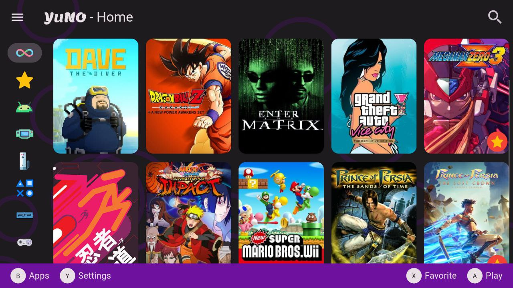
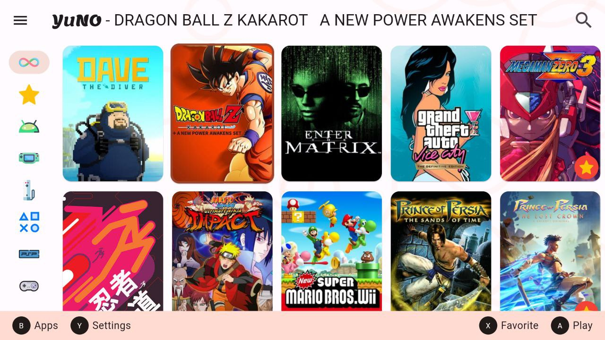

 

# YuNO

YuNO is a minimalist, open-source retro gaming frontend designed to deliver a nostalgic and
efficient gaming experience. This project aims to create a simplified interface for accessing and
playing your favorite retro games.

 

## Characteristics

- **Minimalist**: Clean and simple user interface, focused on gameplay.
- **Compatibility**: Supports a wide variety of emulators and retro games.
- **Open source**: Free to use, modify and distribute, see the [license](LICENSE). Contributions are
  welcome!
- **Customizable**: Options to personalize the experience according to your preferences.

## Inspiration

YuNO took inspiration from Steamdeck and Beacon.
We also used IGDB images for the games and a good amount of Daijishou emulator execution patterns.

## Showcase 🎥

## Prerequisites ⚙️

Before installing YuNO, make sure you have the following requirements:

- Operating System: Android.
- Compatible emulators and ROMs for the games you want to play.

## Installation 🕹️

See [Releases](https://github.com/Flutterando/yuno/releases)

## Contribute 👩‍💻🧑‍💻

I am happy that you are looking to improve YuNO. Please check out
the [contributing guide](CONTRIBUTING.md)

Even if you are not able to make contributions via code, please don't hesitate to file bugs and
feature requests that need to be implemented to solve your use case.

### Authors

    

### License 📄

[YuNO Software License Agreement](LICENSE)
